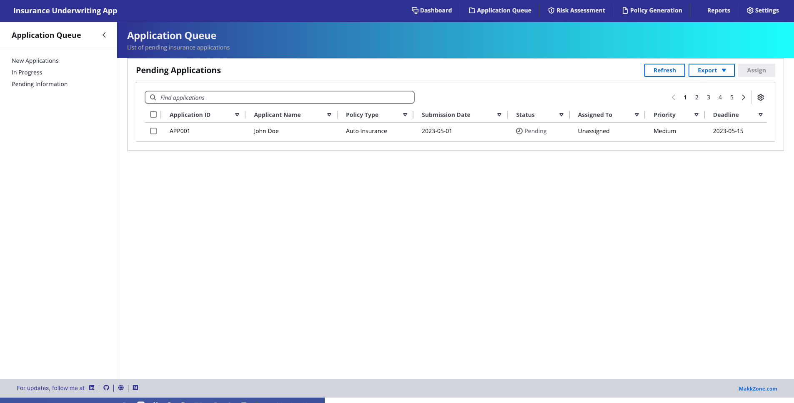

# Gen-UI-Kit

**Gen-UI-Kit** is a powerful tool designed to generate starter web UI kits based on a simple input: a project idea and its description and by utilizing [**LangChain**](https://github.com/langchain-ai/langchain) and UI Design systems such as [**Cloudscape Design System**](https://cloudscape.design/). It helps developers quickly get started on their projects with a tailored UI kit, ready for customization and enhancement. Developers can use this starter kit to connect to their APIs or backends, speeding up the initial phase of development.

Whether you’re working on a new app idea or looking for a quick way to start a front-end interface, Gen-UI-Kit is here to help!

## Key Features

- **Idea-Based UI Generation**: Provide a project idea and its description, and Gen-UI-Kit generates a customized starter UI kit.
- **Cloudscape Design System**: Utilizes components from Cloudscape to ensure a clean, consistent, and modern UI.
- **Customizable Starter Kit**: Get a functional starting point for your web app, which you can easily customize and extend.
- **Backend/ API Ready**: Generated starter kits include placeholders and structured code for easy API and backend integration.
- **Boosts Productivity**: Skip the tedious setup phase and jump straight into building your project with the generated kit.

## How It Works

1. **Input Your Idea**: Describe the project idea and provide a brief description of what it should do. For example: "create starter kit for the idea insurance underwriting app."
2. **Generate Starter Kit**: Gen-UI-Kit uses your input to generate a tailored web UI kit, complete with components and layouts that match your description.

## Installation

1. Using pip:

   ```bash
   pip install gen_ui_kit
   ```

(or)

2. Clone the repo and build locally:

   ```bash
   git clone https://github.com/makkzone/Gen-UI-Kit.git

   cd Gen-UI-Kit

   pip install -e .
   ```

## Usage Example

```python
from langchain_aws import ChatBedrock
from gen_ui_kit import GenUIKit,GenUIKitTools
from langchain.output_parsers import JsonOutputToolsParser

inference_modifier = {'max_tokens':4096, 
                      "temperature":0.5,
                      "top_k":250,
                      "top_p":1,
                      "stop_sequences": ["\n\nHuman"]
                     }

llm = ChatBedrock(model_id="anthropic.claude-3-5-sonnet-20240620-v1:0", model_kwargs=inference_modifier)
parser = JsonOutputToolsParser()

agent_gen_ui_tool_kit = llm.bind_tools([GenUIKitTools.GenUiKitLangchainTool])
chain = agent_gen_ui_tool_kit | parser
structured_response = agent_gen_ui_tool_kit.invoke("""create starter kit for the idea insurance underwriting app. Detailed description about this app followed as below:
                                                           An Insurance Underwriting Web App is a digital platform designed to streamline and automate the process of underwriting insurance policies. Underwriting is the process by which insurers assess the risk of insuring a client and decide the terms and pricing of the insurance policy based on the client's risk profile. This web app would serve both insurance companies and underwriters by providing tools to evaluate risks, generate quotes, and manage applications more efficiently.""")
input_to_tool={}
if structured_response.content=='':
    if structured_response.tool_calls:
        structured_response=structured_response.tool_calls[0]['args']
        if 'properties' in structured_response:
            input_to_tool=structured_response['properties']
        else:
            input_to_tool=structured_response
    else:
        print('invalid tool call')
else:
    print(structured_response.content)

agent_gen_ui_tool_instance=GenUIKit.GenUiKitLangchainTool(**input_to_tool)

agent_gen_ui_tool_instance._run(llm=llm)
```

Checkout the examples [notebooks](https://github.com/makkzone/Gen-UI-Kit/tree/main/notebooks)
